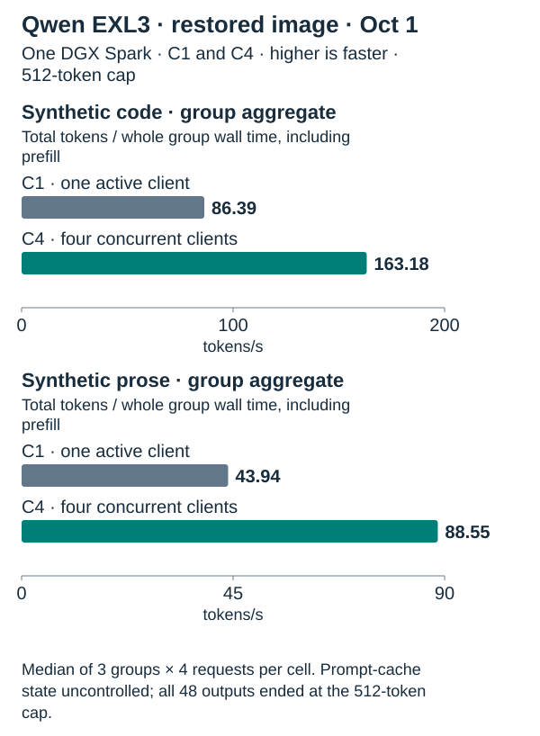
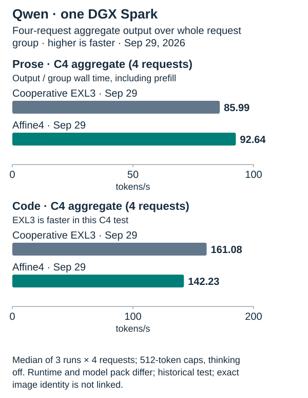
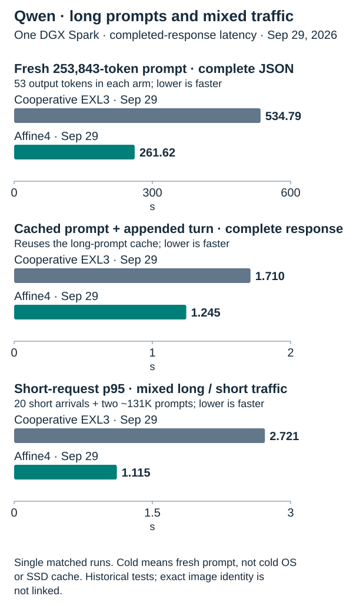
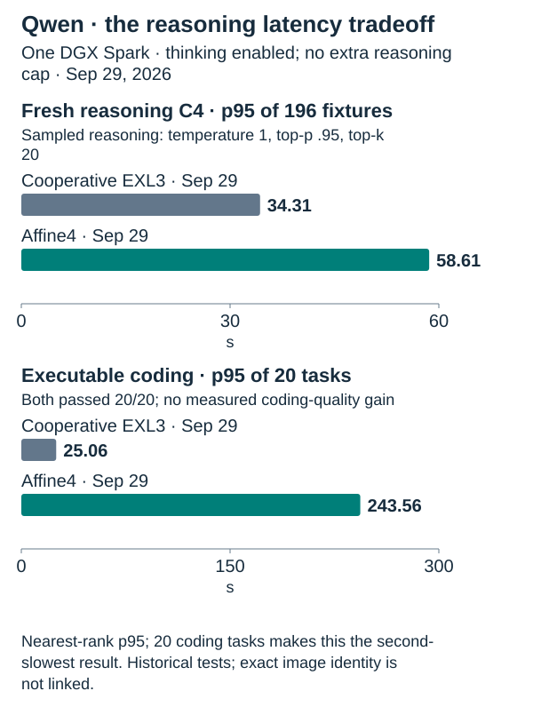
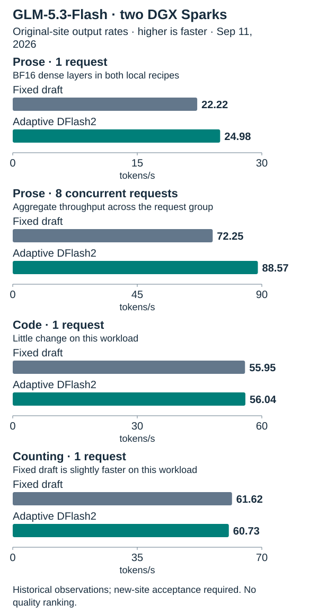

<!-- Generated by spark_serve.comparisons; edit comparisons/README.template.md and models.json. -->
# spark-serve

**Put your DGX Spark to work: Qwen on one, GLM on two.**

Build a local, OpenAI-compatible model server with pinned sources and settings,
practical run guides, and measurements you can inspect. Start with the recipes
below, then choose the tradeoffs that suit your workload. Download model weights
separately from their publishers.

| Your hardware | Recommended recipe · build and run |
| --- | --- |
| 1 Spark | [**Qwen3.8 Flash Next · Cooperative EXL3**](experiments/qwen-tensorfold-cooperative/README.md) |
| 2 Sparks | [**GLM-5.3-Flash · Adaptive DFlash2**](recipes/glm53-flash-adaptive-2spark/README.md) |

These are our recommended starting points for each model. Context and request
counts are configured limits, not a promise of simultaneous maximum-length
capacity. The results below help choose a **recipe**; they do not rank the two
models' quality.

## Choose your setup

```sh
git clone https://github.com/juanandresgs/spark-serve.git
cd spark-serve
```

- **One Spark → [Qwen cooperative EXL3 source guide](experiments/qwen-tensorfold-cooperative/README.md).**
  Follow its pinned build and run steps. It is a **standalone Docker recipe**; the broker's
  `recipes prepare` cannot install it.
- **Two Sparks → [GLM adaptive DFlash2 guide](recipes/glm53-flash-adaptive-2spark/README.md).**
  Follow the [deployment walkthrough](REPRODUCTION.md) to supply your host,
  storage and network bindings, build the runtime, and validate your pair.
  The included broker manages admission, start, stop and recovery for managed
  recipes. New deployments need their own acceptance checks.

Want to compare options first? Run this from the checkout; it works offline:

```sh
PYTHONPATH=src python3 -m spark_serve recipes options
# Narrow the list with --model qwen or --model glm; add --json before recipes.
```

## Qwen: cooperative EXL3 is the recommended starting point

Choose cooperative EXL3 for its measured coding throughput and reasoning
latency. Choose Affine4 when long-prompt completion and mixed-traffic latency
matter more. These one-Spark tests do not establish overall parity with a
two-Spark system.

### Fresh C1/C4 test on the restored EXL3 image · October 1

Both settings used the same identified EXL3 image and four configured backend
slots. C1 used one active client; C4 used four simultaneous clients.



| Workload | C1 · one active client | C4 · four concurrent clients |
| --- | --- | --- |
| Code group aggregate throughput ↑ | 86.39 tokens/s | 163.18 tokens/s |
| Prose group aggregate throughput ↑ | 43.94 tokens/s | 88.55 tokens/s |

Fresh October 1 test on the identified restored EXL3 image. C1 is one active client issuing four serial requests per group; C4 is four concurrent clients. Both used four configured backend slots. Each cell is the median of three groups; group rate is total output tokens divided by whole group wall time including prefill. All responses hit the 512-token cap (finish_reason=length), so this is throughput-only, not correctness or quality evidence. Prompt-cache state was uncontrolled.

<details>
<summary>Per-request decode-rate proxies, separate from group throughput</summary>

| Workload | C1 · one active client | C4 · four concurrent clients |
| --- | --- | --- |
| Code per-request decode-rate proxy | 91.82 tokens/s | 46.00 tokens/s |
| Prose per-request decode-rate proxy | 45.03 tokens/s | 24.18 tokens/s |

Per-request decode-rate proxy from the same test, shown separately from whole-group aggregate throughput. Median across three groups of each group’s median per-request decode proxy; not a C1/C4 aggregate rate.

</details>

The October 1 test used the deployed EXL3 image, TensorFold 0.3.6.1 and the
pinned EXL3 model revision. The public source kit has not been independently
GPU-rebuilt with full performance qualification. See the [recipe guide](experiments/qwen-tensorfold-cooperative/README.md)
and [structured run receipts](evidence/runs/).

### Historical September 29 complete-recipe comparison



TensorFold versions and model packs differ in this historical test. C4 rates
aggregate output over a whole four-request group, including prefill; they are
not per-client rates. Engine slots describe backend capacity, while client
concurrency describes requests offered by the benchmark. These results do not
isolate runtime-engine effects from quantization effects.

In the September 29 test, Affine4 completed the fresh long prompt in **261.62 s**, versus **534.79 s** for EXL3. Mixed-traffic short-request p95 was **1.115 s** for Affine4 and **2.721 s** for EXL3.



The historical September 29 figures do not establish the exact image identity of
every run. The long-prompt figure measures a **completed, validated JSON answer**, not time
to first token. Latency is elapsed waiting time; lower is faster. The median is
the middle result; p95 describes the slow end. Single context/mixed runs and
small tail samples are observations, not guarantees.

This is a comparison of complete configurations: TensorFold versions and
scheduling differ, as do the EXL3 3.05 bpw and Affine4 4-bit model packs. It does
not isolate a runtime-engine effect from a quantization effect.

### Affine4 remains an alternative for long prompts and mixed traffic

Both recipes passed 20/20 executable coding tasks in a small synthetic suite;
this does not establish a coding-quality difference. Affine4 retains stronger
measured long-prompt completion and mixed-traffic short-request latency. Its
fresh public-source build qualification covers bounded API, tool and token-replay
checks, not its historical performance test.



The small reasoning and coding samples do not establish broad model quality. See [EXL3 methodology](experiments/qwen-tensorfold-cooperative/METRICS.md)
and [Affine4 performance and methodology](recipes/qwen38-flash-affine4-1spark/PERFORMANCE.md).

<details>
<summary>Qwen numbers, correctness scores and median / p95 timings</summary>

| Workload | Recommended Cooperative EXL3 · Sep 29 test | Affine4 alternative · Sep 29 test |
| --- | --- | --- |
| C4 prose throughput ↑ | 85.99 tokens/s | 92.64 tokens/s |
| C4 code throughput ↑ | 161.08 tokens/s | 142.23 tokens/s |
| Cold 253,843-token prompt, complete JSON response ↓ | 534.79 s | 261.62 s |
| Cached appended prompt, complete response ↓ | 1.710 s | 1.245 s |
| Short-request p95 during mixed long/short traffic ↓ | 2.721 s | 1.115 s |
| Distinct reasoning answers correct ↑ | 294/296 | 296/296 |
| Executable coding tasks correct ↑ | 20/20 | 20/20 |
| Fresh reasoning latency, median / p95 ↓ | 7.09 / 34.31 s | 8.56 / 58.61 s |
| Coding latency, median / p95 ↓ | 12.67 / 25.06 s | 14.80 / 243.56 s |

Historical September 29 one-Spark test; four engine slots and 262K configured context. C4 sent four concurrent benchmark requests; throughput is aggregate output tokens / whole request-group time, including prefill. Three-run throughput medians; context/mixed/quality checks have their own sample limits. Runtime and model pack differ; this does not establish exact image identity.

Reasoning and coding correctness/latency use sampled thinking; C4 throughput
and context checks use thinking off. Repeated reasoning fixtures are excluded
from the totals. Correctness is separate from speed.

</details>

## GLM: adaptive drafting on two Sparks

DFlash2 drafts tokens ahead, then verifies them against the target model.
The adaptive recipe varies the draft length while retaining BF16 dense layers
and the same configured serving capacity as our fixed-draft control.

Recorded prose output rates were **24.98 tokens/s** with adaptive drafting versus **22.22 tokens/s** with fixed drafts at one request; **88.57 tokens/s** versus **72.25 tokens/s** across eight requests.



GLM and Qwen use different hardware, workloads and measurement histories.
Read each panel within its own model. GLM's figures are original-site
observations from September 11; they do not qualify a fresh portable deployment.

<details>
<summary>GLM numeric comparison and evidence scope</summary>

| Workload | Previous fixed draft length | Recommended adaptive |
| --- | --- | --- |
| Single-request prose | 22.22 tokens/s | 24.98 tokens/s |
| Eight-request aggregate prose | 72.25 tokens/s | 88.57 tokens/s |
| Single-request code | 55.95 tokens/s | 56.04 tokens/s |
| Single-request counting | 61.62 tokens/s | 60.73 tokens/s |

Original-site two-Spark observations; portable package requires destination acceptance.

[Recorded checks](recipes/glm53-flash-adaptive-2spark/results.json) include eight
long-context checks and five structured-tool/mixed checks. Configured context is
850K; the largest recorded fixture was about 801K tokens.

</details>

## What you can rely on—and what still needs testing

**Affine4:** the shared sources were independently rebuilt on a Spark. That build
passed 11 API checks, 36 tool/API checks, six exact sampled token replays,
10 adapter tests and a real file-reader check. The performance and quality
results above belong to the qualified production image; they were not rerun in
full on the rebuild. Verified weights were reused. A fresh-download clean-machine
test, long soak and reboot qualification remain open.
[Build evidence](recipes/qwen38-flash-affine4-1spark/BUILD-VALIDATION.md).

**GLM:** the portable source package and site rendering pass offline checks.
The measured original runtime's results do not establish rebuilt-image or
new-site behavior. Recoverable startup allocation warnings remain unresolved.
[Release qualification gates](MASTER_PLAN.md).

## More choices and comparison sources

- [Qwen3.8 Flash Next · Affine4](recipes/qwen38-flash-affine4-1spark/README.md): Stronger measured long-prompt completion and mixed-traffic tail latency in its packaged-source test; its independent fresh-source rebuild does not establish that those results used the rebuilt image.
- [Qwen3.8 Flash Next · vLLM / NVFP4](recipes/qwen38-flash-1spark/README.md): Previous managed recipe; retained for existing deployments.
- [GLM-5.3-Flash · Fixed draft length](recipes/glm53-flash-2spark/README.md): Retained historical GLM configuration; see its own qualification evidence.
- [All recipes](recipes/): four-Spark GLM, mixed fleets, full GLM and historical experiments, each with its own status.

<details>
<summary>Public reference figures: useful context, unmatched measurements</summary>

The following are **historical figures reported by MiaAI-Lab**, preserved at
pinned source revisions. Public decode rates differ from our full-group Qwen
rates, and public prefill latency differs from our completed-response latency.

| Model / metric | Public reference | Our result | Comparison boundary |
| --- | --- | --- | --- |
| Qwen C4 prose | 106.7 tokens/s | 85.99 tokens/s | Historical local C4 aggregate from Sep 29; the EXL3 source/image identity is not linked to the adopted image. Public number is decode rate. |
| Qwen long-prompt latency | 59.60 s at 131,110 tokens | 534.79 s at 253,843 tokens | Public time to first token; local EXL3 time to complete validated JSON, with a much longer prompt. Separate historical tests. |
| GLM single-request prose | 32.1 tokens/s | 24.98 tokens/s | Public adaptive **FP8 dense** configuration; ours retains **BF16 dense** layers |
| GLM structured/code | 62.9 tokens/s at C1; 146.5 at C4 | 56.04 tokens/s at C1 | Different prompts; public high-acceptance decode workload, no matched C4 result here |

Different prompts, timing definitions, runtime versions and dense precision; no cross-source winner or speedup may be inferred.

Sources: [Pinned Qwen benchmark README](https://github.com/MiaAI-Lab/Qwen3.8-Flash-Next-Single-DGX-Spark-TensorFold/blob/856bb6be4b58ce6a6727e6d071fb1c52f3f80e6e/README.md), [Pinned GLM benchmark README](https://github.com/MiaAI-Lab/GLM-5.3-Flash-EXL3-2x-DGX-Sparks/blob/dc6936cea8fd7b2e7ee5b7a48a5aa193857ca489/README.md).

Public Qwen uses TensorFold 0.3.6.3; the local EXL3 test uses TensorFold 0.3.6.1. GLM's
pinned prose figure is from September 8 with FP8 dense layers and a 14 GiB KV
budget; our local recipe retains BF16 dense layers with 11 GiB KV. Its public
structured/code figures are a separate August 28 workload.
The [source audit and newer upstream reports](comparisons/SOURCES.md) explain
what changed. None of these figures supports a cross-source winner.

</details>

The tables and charts share [one evidence source](comparisons/README.md); checks
reject stale generated output. Our Qwen adapters were independently written;
the public implementation was not imported.

The broker is MIT licensed. Derived runtimes retain upstream licenses; model
access and licenses remain with their publishers. See [third-party notices](THIRD_PARTY.md),
[source pins](sources.json) and each recipe's notices.
