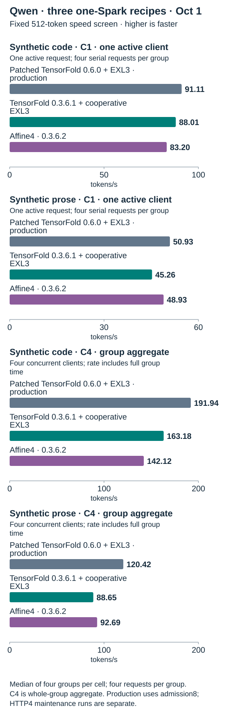

<!-- Generated by spark_serve.comparisons; edit comparisons/README.template.md and models.json. -->
# spark-serve

**Choose a one-Spark Qwen recipe or a two-Spark GLM recipe.**

Build a local, OpenAI-compatible model server with pinned sources and settings,
practical run guides, and measurements you can inspect. Start with the recipes
below, then choose the tradeoffs that suit your workload. Download model weights
separately from their publishers.

| Your hardware | Recommended recipe · build and run |
| --- | --- |
| 1 Spark | [**Qwen3.8 Flash Next · Patched TensorFold 0.6 + EXL3**](experiments/qwen-tensorfold-native-0.6/README.md) |
| 2 Sparks | [**GLM-5.3-Flash · Adaptive DFlash2**](recipes/glm53-flash-adaptive-2spark/README.md) |

These are our recommended starting points for each model. They are deployment
choices; the measurements below do not establish performance parity between
one- and two-Spark systems. Context and request
counts are configured limits, not a promise of simultaneous maximum-length
capacity. The results below help choose a **recipe**; they do not rank the two
models' quality.

## Choose your setup

```sh
git clone https://github.com/juanandresgs/spark-serve.git
cd spark-serve
```

- **One Spark → [patched TensorFold 0.6 + EXL3 source guide](experiments/qwen-tensorfold-native-0.6/README.md).**
  Follow its pinned build and run steps. It is a **standalone Docker recipe**; the broker's
  `recipes prepare` cannot install it.
- **Two Sparks → [GLM adaptive DFlash2 guide](recipes/glm53-flash-adaptive-2spark/README.md).**
  Follow the [deployment walkthrough](REPRODUCTION.md) to supply your host,
  storage and network bindings, build the runtime, and validate your pair.
  The included broker manages admission, start, stop and recovery for managed
  recipes. New deployments need their own acceptance checks.

Want to compare options first? Run this from the checkout; it works offline:

```sh
PYTHONPATH=src python3 -m spark_serve recipes options
# Narrow the list with --model qwen or --model glm; add --json before recipes.
```

## Qwen fixed-cap speed screen · October 1

TensorFold is the serving runtime; EXL3 and Affine4 are different weight formats. This compares complete one-Spark recipes, not isolated runtime or quantization effects. C1 has one active request; C4 shows the combined rate for four concurrent clients.



| Cell · aggregate throughput | Patched TF0.6 EXL3 | TF0.3.6.1 EXL3 | Affine4 |
| --- | --- | --- | --- |
| Code · C1 · one active client | 91.11 tokens/s | 88.01 tokens/s | 83.20 tokens/s |
| Prose · C1 · one active client | 50.93 tokens/s | 45.26 tokens/s | 48.93 tokens/s |
| Code · C4 · four concurrent clients | 191.94 tokens/s | 163.18 tokens/s | 142.12 tokens/s |
| Prose · C4 · four concurrent clients | 120.42 tokens/s | 88.65 tokens/s | 92.69 tokens/s |

Median of four groups per cell, with 64 measured requests per recipe. C1 is one active request; C4 is the combined rate for four simultaneous clients. Rates use full-group wall time, including prefill. All responses reached the 512-token cap; this measures throughput, not task quality. The complete recipes differ; the second native host is shown separately. Gateway admission is separate from engine slots.

Across these measured recipes, patched TensorFold 0.6 + EXL3 had the highest C4 aggregate throughput; Affine4 returned faster cold long-prompt responses in separate tests, with strict-format failures at some sizes. These are complete recipes with different runtime and weight settings, so choose based on throughput, long-prefill latency and format requirements.

<details>
<summary>Test method, recipe settings and observed ranges</summary>

The `cell-warmup-v2` schedule used four measured groups per cell, each containing
four requests, after 17 excluded warmups. C1 sent the four requests serially;
C4 sent them concurrently. Rates divide all output tokens by complete group
wall time, including prefill. The selected production run used HTTP admission 8
with four engine slots. No cache reset was performed. C4 is an aggregate
group rate, never a per-client rate. The four-slot engine setting describes
backend capacity; gateway HTTP admission is separate.

Patched TensorFold 0.6.0 + EXL3 used BF16 KV, native memory-managed prefix defaults,
burst4 and 1024-row prefill. The previous cooperative EXL3 recipe used TensorFold 0.3.6.1, BF16 KV, a
2 GiB prompt cache and snapshots disabled. Affine4 used TensorFold 0.3.6.2, a
different 4-bit weight pack and int8 KV. The production primary used gateway admission 8. Earlier maintenance-primary and second-host speed runs used admission 4; all are independent results and are never pooled. Run records below link the exact
medians, per-cell ranges and source identity boundary.

Run receipts: [patched TensorFold 0.6 production primary](evidence/runs/production-final1024-http8-speed-v2-20261001.json), [earlier maintenance primary](evidence/runs/native-primary-speed-v2-20261001.json), [independent second-host maintenance run](evidence/runs/native-replica-speed-v2-20261001.json), [cooperative EXL3](evidence/runs/qwen-cooperative-exl3-speed-v2-20261001.json), and [Affine4](evidence/runs/qwen-affine4-speed-v2-20261001.json). Each receipt links its public source projection with group totals and provenance.

</details>

<details>
<summary>Per-request decode proxies and the second native-host replication</summary>

| Per-request decode proxy | TensorFold 0.6.0 + EXL3 | TensorFold 0.3.6.1 + cooperative EXL3 | TensorFold 0.3.6.2 + Affine4 |
| --- | --- | --- | --- |
| Code · C1 · one active client · per-request decode proxy | 94.88 tokens/s | 92.44 tokens/s | 86.55 tokens/s |
| Prose · C1 · one active client · per-request decode proxy | 51.99 tokens/s | 45.07 tokens/s | 49.47 tokens/s |
| Code · C4 · four concurrent clients · per-request decode proxy | 53.44 tokens/s | 45.93 tokens/s | 39.29 tokens/s |
| Prose · C4 · four concurrent clients · per-request decode proxy | 32.02 tokens/s | 23.84 tokens/s | 24.61 tokens/s |

Median per-request decode-rate proxy across 16 requests for each cell; completion tokens minus one divided by first-to-last output event interval. This excludes full-group prefill and queue time and is not the C1/C4 aggregate throughput shown above. All requests are fixed-cap and length-finished; values remain synthetic speed measurements, not correctness or quality.

| Cell · aggregate | Earlier maintenance primary · HTTP4 · n=4 | Second host · HTTP4 · n=4 |
| --- | --- | --- |
| Code · C1 · group aggregate | 91.41 tokens/s | 91.44 tokens/s |
| Prose · C1 · group aggregate | 51.02 tokens/s | 51.04 tokens/s |
| Code · C4 · group aggregate | 202.08 tokens/s | 205.75 tokens/s |
| Prose · C4 · group aggregate | 124.57 tokens/s | 122.39 tokens/s |

Earlier maintenance primary and independent second native host: separate runs of the same TensorFold 0.6.0 + EXL3 source variant, four engine slots, BF16 KV, burst4 and prefill1024. Both used HTTP admission 4; each has four groups per cell and 64 measured requests total. Ranges are in the linked source projections. Neither is pooled with the October 1 production-admission-8 primary.

The decode figures use a first-to-last-output-event timing proxy for individual requests; they exclude full-group prefill and queue time. The second native host is a separate four-group replication of the same source recipe, not pooled with the primary host.

</details>

## Bounded reasoning and executable coding checks

These samples used medium sampled thinking with four concurrent clients. They
are synthetic exact-answer checks, not a broad model-quality benchmark. Each
sampling-seed cohort contains 200 request rows over the same 195 distinct
prompts; the code suite has 20 small executable cases.

| Bounded synthetic check | Patched TensorFold 0.6 + EXL3 | Cooperative TensorFold 0.3.6.1 + EXL3 | Affine4 · TensorFold 0.3.6.2 |
| --- | --- | --- | --- |
| Reasoning prompts correct on first sample · of 195 distinct | 195 / 195 | 195 / 195 | 192 / 195 |
| Executable coding cases passed · of 20 | 20 / 20 | 20 / 20 | 20 / 20 |

Final production-admission-8 C4 sample: 200 sampled-thinking reasoning request rows, 195 distinct generated prompts, plus 20 small executable Python cases. The other recipe columns are their separately identified quiet C4 cohorts. These bounded synthetic checks do not establish broad model quality.

The final production-admission-8 cohort passed all 200 reasoning request rows
over 195 distinct prompts, and all 20 executable coding cases. The earlier
admission-4 candidate cohort (199/200 request rows, one HTTP 429; 194/195
distinct prompts on the first sample) is retained separately in the linked
records. These are bounded synthetic checks, not a broad model-quality claim.

## Context and mixed-request trade-offs

The context ladder tested roughly 8K, 65K, 131K and 254K prompts, one request
at a time with thinking off and four engine slots configured. These formal
context/mixed checks used the final image before cutover under maintenance HTTP
admission 4; the production speed cohort used admission 8. Context capacity
was 262,144 tokens; the near-limit prompt contained 253,836 tokens. The table
keeps observed response time separate from the strict bare-JSON gate.

| Context check | Patched TensorFold 0.6 + EXL3 | Cooperative TensorFold 0.3.6.1 + EXL3 | Affine4 · TensorFold 0.3.6.2 |
| --- | --- | --- | --- |
| 131,091-token prompt (target 131,072) · observed completion | 184.50 s | 183.10 s | 66.94 s |
| 131,091-token prompt (target 131,072) · strict JSON pass · of 1 | 1 / 1 | 1 / 1 | 0 / 1 |
| 253,836-token prompt (target 253,824) · observed completion | 372.37 s | 535.50 s | 270.66 s |
| 253,836-token prompt (target 253,824) · strict JSON pass · of 1 | 1 / 1 | 1 / 1 | 0 / 1 |
| 253,836-token exact resend (target 253,824) · observed completion | 1.03 s | 535.36 s | 270.70 s |
| 253,836-token exact resend (target 253,824) · strict JSON pass · of 1 | 1 / 1 | 1 / 1 | 0 / 1 |

Formal single-request context retrieval at four configured engine slots, thinking off and temperature 0. The configured context is 262,144 tokens; the near-limit prompt contained 253,836 tokens. Observed response time and strict bare-JSON success are separate fields: an Affine4 response can retrieve the correct value yet fail the strict-format gate. The final-image tests ran under maintenance gateway admission 4 before cutover; the final production fixed-cap speed cohort used admission 8.

| Mixed request · median response time | Patched TensorFold 0.6 + EXL3 | Cooperative TensorFold 0.3.6.1 + EXL3 | Affine4 · TensorFold 0.3.6.2 |
| --- | --- | --- | --- |
| 131,072 context · active short code · n=2 | 85.31 s | 140.42 s | 64.53 s |
| 131,072 context · new short prose · n=4 | 49.32 s | 79.20 s | 37.87 s |
| 131,072 context · long retrieval · n=2 | 198.07 s | 198.89 s | 84.53 s |
| 253,824 context · active short code · n=2 | 85.49 s | 140.50 s | 64.56 s |
| 253,824 context · new short prose · n=4 | 49.52 s | 79.54 s | 37.95 s |
| 253,824 context · long retrieval · n=2 | 385.77 s | 551.27 s | 288.24 s |

Two quiet repetitions of matched C4 mixed-load prompt sequences with the same prompt token counts and output caps across recipes. Values are median observed end-to-end response times, not p95. New short-prose and active-short-code requests are capped responsiveness gates, not completed-task quality tests. Long-prefill strict JSON success is reported separately; the Affine4 131,072-token long rows retrieved the correct value but failed strict bare-JSON formatting. The final-image tests ran under maintenance gateway admission 4 before cutover; the final production fixed-cap speed cohort used admission 8.

The mixed test paired 16 prompt rows per recipe across two repetitions. Native
and cooperative EXL3 passed the strict retrieval gate at both long-prompt
sizes. Affine4's 131,072-token long-retrieval responses returned the correct
value but failed the strict JSON format check; at 253,824 tokens they passed
both checks. The short code and prose cells are capped responsiveness probes,
not completed-task quality scores. Sample counts are small, so these tables
report no p95.

<details>
<summary>Context cache observations and Affine4 response_format option</summary>

The patched native image's exact 253,836-token resend reused 253,835 prompt
tokens and completed in about 1.03 seconds. The cooperative EXL3 and plain
Affine4 resends had no reported prompt-cache hits. In the mixed run, repeated
near-limit short requests reported two native cache hits in active code and
four in new prose; no cache reset was performed, so the mixed cells are not
described as uniformly cold.

Affine4 also passed two single-request, opt-in API `response_format` probes at
131,072 and 253,824 tokens. They used buffered fence normalization and schema
validation; this is not constrained generation and does not replace the plain
prompt format failures above.

API compatibility also differs by complete recipe. The final native production
image passed a 48-check API/tool capability matrix (12 basic and 36 typed-tool
checks), plus separate front-cancel recovery and Pi/Hermes adapter-client checks.
The matrix is capability evidence, not a latency benchmark; 48 counts checks,
not HTTP requests. Strict `json_schema` response formatting returns HTTP 400.
Affine4's opt-in `response_format` path buffers the response, normalizes a
trailing fence, then validates the schema; it is not constrained generation.

Core receipts: [patched native](evidence/runs/qwen-native-final-core-20261001.json),
[cooperative EXL3](evidence/runs/qwen-cooperative-final-core-20261001.json), and
[Affine4](evidence/runs/qwen-affine4-final-core-20261001.json). The final production
API and named-client acceptance is recorded separately in
[the acceptance run](evidence/runs/production-final1024-http8-acceptance-20261001.json). These records
link sanitized numeric source projections; they omit private routes, raw
outputs, and per-prompt hashes.

</details>

## Qwen: patched TensorFold 0.6 + EXL3 is recommended with caveats

Use the patched TensorFold 0.6 + EXL3 guide for the measured one-Spark recipe;
TensorFold is the serving software and EXL3 is the weight format. Affine4 remains
a useful alternative when cold long-prefill response time matters, with strict
JSON-format limitations described below. The cooperative EXL3 guide remains a
rollback path for existing deployments.

<details>
<summary>Earlier cooperative EXL3 and September comparison tests</summary>

### Fresh C1/C4 test on the restored EXL3 image · October 1

Both settings used the same identified EXL3 image and four configured backend
slots. C1 used one active client; C4 used four simultaneous clients.


| Workload | C1 · one active client | C4 · four concurrent clients |
| --- | --- | --- |
| Code group aggregate throughput ↑ | 86.39 tokens/s | 163.18 tokens/s |
| Prose group aggregate throughput ↑ | 43.94 tokens/s | 88.55 tokens/s |

Fresh October 1 test on the identified restored EXL3 image. C1 is one active client issuing four serial requests per group; C4 is four concurrent clients. Both used four configured backend slots. Each cell is the median of three groups; group rate is total output tokens divided by whole group wall time including prefill. All responses hit the 512-token cap (finish_reason=length), so this is throughput-only, not correctness or quality evidence. Prompt-cache state was uncontrolled.

<details>
<summary>Per-request decode-rate proxies, separate from group throughput</summary>

| Workload | C1 · one active client | C4 · four concurrent clients |
| --- | --- | --- |
| Code per-request decode-rate proxy | 91.82 tokens/s | 46.00 tokens/s |
| Prose per-request decode-rate proxy | 45.03 tokens/s | 24.18 tokens/s |

Per-request decode-rate proxy from the same test, shown separately from whole-group aggregate throughput. Median across three groups of each group’s median per-request decode proxy; not a C1/C4 aggregate rate.

</details>

The October 1 test used the deployed EXL3 image, TensorFold 0.3.6.1 and the
pinned EXL3 model revision. It is retained as historical evidence; the current
recommendation uses the separately identified patched TensorFold 0.6 image. See the [recipe guide](experiments/qwen-tensorfold-cooperative/README.md)
and [structured run receipts](evidence/runs/).

### Historical September 29 complete-recipe comparison


TensorFold versions and model packs differ in this historical test. C4 rates
aggregate output over a whole four-request group, including prefill; they are
not per-client rates. Engine slots describe backend capacity, while client
concurrency describes requests offered by the benchmark. These results do not
isolate runtime-engine effects from quantization effects.

In the September 29 test, Affine4 completed the fresh long prompt in **261.62 s**, versus **534.79 s** for EXL3. Mixed-traffic short-request p95 was **1.115 s** for Affine4 and **2.721 s** for EXL3.


The historical September 29 figures do not establish the exact image identity of
every run or effective reasoning effort across the runtime versions. Their
reasoning scores and latencies are not a matched-medium quality comparison. The
long-prompt figure measures a **completed, validated JSON answer**, not time
to first token. Latency is elapsed waiting time; lower is faster. The median is
the middle result; p95 describes the slow end. Single context/mixed runs and
small tail samples are observations, not guarantees.

This is a comparison of complete configurations: TensorFold versions and
scheduling differ, as do the EXL3 3.05 bpw and Affine4 4-bit model packs. It does
not isolate a runtime-engine effect from a quantization effect.

</details>

### Affine4 remains an alternative for long prompts and mixed traffic

Both recipes passed 20/20 executable coding tasks in a small synthetic suite;
this does not establish a coding-quality difference. Affine4 retains stronger
measured long-prompt completion and mixed-traffic short-request latency. Its
fresh public-source build qualification covers bounded API, tool and token-replay
checks, not its historical performance test.


The small reasoning and coding samples do not establish broad model quality. See [EXL3 methodology](experiments/qwen-tensorfold-cooperative/METRICS.md)
and [Affine4 performance and methodology](recipes/qwen38-flash-affine4-1spark/PERFORMANCE.md).

<details>
<summary>Qwen numbers, correctness scores and median / p95 timings</summary>

| Workload | Recommended Cooperative EXL3 · Sep 29 test | Affine4 alternative · Sep 29 test |
| --- | --- | --- |
| C4 prose throughput ↑ | 85.99 tokens/s | 92.64 tokens/s |
| C4 code throughput ↑ | 161.08 tokens/s | 142.23 tokens/s |
| Cold 253,843-token prompt, complete JSON response ↓ | 534.79 s | 261.62 s |
| Cached appended prompt, complete response ↓ | 1.710 s | 1.245 s |
| Short-request p95 during mixed long/short traffic ↓ | 2.721 s | 1.115 s |
| Distinct reasoning answers correct ↑ | 294/296 | 296/296 |
| Executable coding tasks correct ↑ | 20/20 | 20/20 |
| Fresh reasoning latency, median / p95 ↓ | 7.09 / 34.31 s | 8.56 / 58.61 s |
| Coding latency, median / p95 ↓ | 12.67 / 25.06 s | 14.80 / 243.56 s |

Historical September 29 one-Spark test; four engine slots and 262K configured context. C4 sent four concurrent benchmark requests; throughput is aggregate output tokens / whole request-group time, including prefill. Three-run throughput medians. The historical quality and context receipts have separate sample limits, and the source does not attest their client concurrency. Runtime and model pack differ; this does not establish exact image identity.

Reasoning and coding correctness/latency use sampled thinking; concurrency for these historical quality rows is unknown. C4 throughput and context checks use thinking off. Repeated reasoning fixtures are excluded from the totals. Correctness is separate from speed.

</details>

## GLM: adaptive drafting on two Sparks

DFlash2 drafts tokens ahead, then verifies them against the target model.
The adaptive recipe varies the draft length while retaining BF16 dense layers
and the same configured serving capacity as our fixed-draft control.

Recorded prose output rates were **24.98 tokens/s** with adaptive drafting versus **22.22 tokens/s** with fixed drafts at one request; **88.57 tokens/s** versus **72.25 tokens/s** across eight requests.


GLM and Qwen use different hardware, workloads and measurement histories.
Read each panel within its own model. GLM's figures are original-site
observations from September 11; they do not qualify a fresh portable deployment.

<details>
<summary>GLM numeric comparison and evidence scope</summary>

| Workload | Previous fixed draft length | Recommended adaptive |
| --- | --- | --- |
| Single-request prose | 22.22 tokens/s | 24.98 tokens/s |
| Eight-request aggregate prose | 72.25 tokens/s | 88.57 tokens/s |
| Single-request code | 55.95 tokens/s | 56.04 tokens/s |
| Single-request counting | 61.62 tokens/s | 60.73 tokens/s |

Original-site two-Spark observations; portable package requires destination acceptance.

[Recorded checks](recipes/glm53-flash-adaptive-2spark/results.json) include eight
long-context checks and five structured-tool/mixed checks. Configured context is
850K; the largest recorded fixture was about 801K tokens.

</details>

## What you can rely on—and what still needs testing

**Affine4:** the shared sources were independently rebuilt on a Spark. That build
passed 11 API checks, 36 tool/API checks, six exact sampled token replays,
10 adapter tests and a real file-reader check. The performance and quality
results above belong to the qualified production image; they were not rerun in
full on the rebuild. Verified weights were reused. A fresh-download clean-machine
test, long soak and reboot qualification remain open.
[Build evidence](recipes/qwen38-flash-affine4-1spark/BUILD-VALIDATION.md).

**GLM:** the portable source package and site rendering pass offline checks.
The measured original runtime's results do not establish rebuilt-image or
new-site behavior. Recoverable startup allocation warnings remain unresolved.
[Release qualification gates](MASTER_PLAN.md).

## More choices and comparison sources

- [Qwen3.8 Flash Next · Cooperative EXL3](experiments/qwen-tensorfold-cooperative/README.md): Retained rollback and alternative using the previously deployed cooperative TensorFold 0.3.6.1 EXL3 recipe.
- [Qwen3.8 Flash Next · Affine4](recipes/qwen38-flash-affine4-1spark/README.md): Stronger measured long-prompt completion and mixed-traffic tail latency in its packaged-source test; its independent fresh-source rebuild does not establish that those results used the rebuilt image.
- [Qwen3.8 Flash Next · vLLM / NVFP4](recipes/qwen38-flash-1spark/README.md): Previous managed recipe; retained for existing deployments.
- [GLM-5.3-Flash · Fixed draft length](recipes/glm53-flash-2spark/README.md): Retained historical GLM configuration; see its own qualification evidence.
- [All recipes](recipes/): four-Spark GLM, mixed fleets, full GLM and historical experiments, each with its own status.

<details>
<summary>Public reference figures: useful context, unmatched measurements</summary>

The following are **historical figures reported by MiaAI-Lab**, preserved at
pinned source revisions. Public decode rates differ from our full-group Qwen
rates, and public prefill latency differs from our completed-response latency.
The public C1 reference is one active request on a four-stream backend; the
source does not report its repetition count or exact decode-rate denominator.
The local selected-image C1 decode proxy is 51.99 tokens/s; the local full-request
C1 group rate is a separate measurement. The public repetition count and exact
decode denominator are unstated, so the timing boundary remains approximate and
we do not infer a cross-source winner.

| Model / metric | Public reference | Our result | Comparison boundary |
| --- | --- | --- | --- |
| Qwen C1 prose decode | 62.4 tokens/s | 51.99 tokens/s | Pinned MiaAI-Lab C1 row: one active request on a four-stream backend. Its repetition count and exact decode-rate denominator are unstated. Local TensorFold 0.6.0 + EXL3 reports a separate first-to-last-output-event per-request decode proxy; its C1 full-group rate includes prompt processing and serial-group wall time. These timing definitions and source details differ; no cross-source winner is inferred. |
| Qwen C4 prose | 106.7 tokens/s | 85.99 tokens/s | Historical local C4 aggregate from Sep 29; the EXL3 source/image identity is not linked to the adopted image. The public README does not state repetitions for its C4 decode row. |
| Qwen long-prompt latency | 59.60 s at 131,110 tokens | 534.79 s at 253,843 tokens | Public time to first token; local EXL3 time to complete validated JSON, with a much longer prompt. Separate historical tests. |
| GLM single-request prose | 32.1 tokens/s | 24.98 tokens/s | Public adaptive **FP8 dense** configuration; ours retains **BF16 dense** layers |
| GLM structured/code | 62.9 tokens/s at C1; 146.5 at C4 | 56.04 tokens/s at C1 | Different prompts; public high-acceptance decode workload, no matched C4 result here |

Different prompts, timing definitions, runtime versions and dense precision; no cross-source winner or speedup may be inferred.

Sources: [Pinned Qwen benchmark README](https://github.com/MiaAI-Lab/Qwen3.8-Flash-Next-Single-DGX-Spark-TensorFold/blob/856bb6be4b58ce6a6727e6d071fb1c52f3f80e6e/README.md), [Pinned GLM benchmark README](https://github.com/MiaAI-Lab/GLM-5.3-Flash-EXL3-2x-DGX-Sparks/blob/dc6936cea8fd7b2e7ee5b7a48a5aa193857ca489/README.md).

Public Qwen uses TensorFold 0.3.6.3; the local EXL3 test uses TensorFold 0.3.6.1. GLM's
pinned prose figure is from September 8 with FP8 dense layers and a 14 GiB KV
budget; our local recipe retains BF16 dense layers with 11 GiB KV. Its public
structured/code figures are a separate August 28 workload.
The [source audit and newer upstream reports](comparisons/SOURCES.md) explain
what changed. None of these figures supports a cross-source winner.

</details>

The tables and charts share [one evidence source](comparisons/README.md); checks
reject stale generated output. Our Qwen adapters were independently written;
the public implementation was not imported.

The broker is MIT licensed. Derived runtimes retain upstream licenses; model
access and licenses remain with their publishers. See [third-party notices](THIRD_PARTY.md),
[source pins](sources.json) and each recipe's notices.
